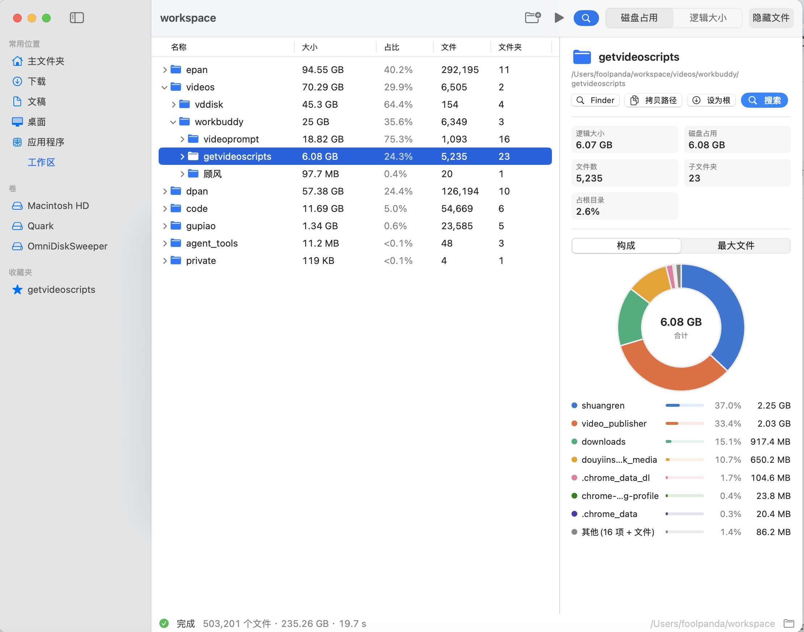
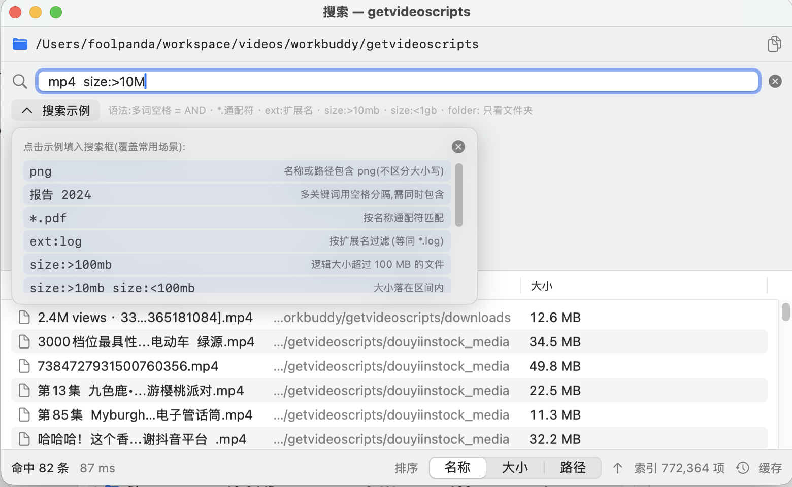

# FolderSize — macOS 文件夹大小统计

参考 [Folder Size Explorer](https://www.folder-size.com/) 的思路,用 SwiftUI 编写的 macOS 原生文件夹大小统计工具。

## 界面预览

**统计视图**(树形大小 / 占比 / 文件数,右侧详情与环形图):



**Everything 式搜索**(输入即搜,示例面板点击即用):



## 功能

- **渐进式扫描**:后台 `NSDirectoryEnumerator` 深度遍历,边扫边出结果,不用等整个目录扫完
- **树形视图**:文件夹层级按大小降序展开,显示大小 / 占父目录比 / 文件数 / 子文件夹数
- **双口径**:磁盘占用(实际分配块)与逻辑大小(字节数)一键切换
- **环形图**:选中文件夹的子目录大小构成(前 7 项 + 其他),带占比条图例
- **最大文件榜**:整个扫描范围内 Top 150 大文件
- **Everything 式搜索**(⌘F):右键任意文件夹"在此文件夹中搜索…"弹出独立搜索窗口。窗口分四段:第一行显示待搜索的**全路径**(可一键拷贝)、第二行是**独立的关键词输入框**(打开即聚焦,输入即搜,带 ✕ 清空)、第三行是**示例行**——收起时只占一行(示例按钮 + 语法提示),点"搜索示例"**浮出面板**展示 9 组常用场景(查询串 + 说明,点击即用)与最近搜索;下方为实时结果列表,双击在 Finder 定位,扫描进行中也可搜索
- **搜索语法**:多关键词空格分隔(AND,按相对路径匹配,不区分大小写)、`*.pdf`/`IMG_*.jpg` 名称通配符、`ext:log` 扩展名、`size:>100mb` / `size:<1gb` / `size:>=2kb` 大小比较(单位 b/kb/mb/gb/tb)、`folder:` 只看文件夹(可带关键词如 `folder:node`)、`file:` 只看文件,均可自由组合,如 `mp4 size:>500mb`
- **索引落盘**:完整扫描后自动保存二进制索引(`~/Library/Application Support/FolderSize/Indexes/*.fsidx`);再次打开同一目录**秒载缓存不再扫描**(状态栏显示"已载入缓存",点"重新扫描"刷新);另支持 文件菜单 → 导出索引…/打开索引… 交换 `.fsidx` 文件
- **隐藏文件开关**、错误统计(无权限目录计数)、Finder 定位、拷贝路径、右键"设为根"重扫
- **收藏夹**(侧栏"卷"下方):中间树列表右键文件夹 →「添加到收藏夹」(收藏到顶层 / 已有分类 / 新建分类)。类似 Chrome 收藏夹,支持**多级分类**整理:右键分类或收藏可 重命名 / 新建子分类 / 移动到分类(子菜单带层级轨迹)/ 删除(分类连同其下收藏);点击收藏即扫描(缓存优先),目录已失效时提示并可一键清理;收藏树与分类展开状态持久化,重启不丢
- **打开方式 / 目录启动器**:收藏夹和树列表的右键菜单可直接 在访达中显示 / 在终端中打开(默认 Terminal.app),并支持**自定义启动器**——预置 `cmux`,可添加任意命令(如 VS Code、iTerm),命令在新终端窗口的目标目录下执行,`{path}` 代表目录路径;首次使用自定义启动器需授权"控制终端"
- 拖拽文件夹到欢迎页、侧栏快速定位(主文件夹/下载/文稿/应用程序/各卷)
- 支持命令行启动直达:`FolderSize --path ~/Downloads`

## 构建与运行

本机需用完整 Xcode 工具链(CLT 缺少 SwiftUIMacros 宏插件):

```bash
DEVELOPER_DIR=/Applications/Xcode.app/Contents/Developer swift build
swift run FolderSize                 # 或 .build/debug/FolderSize
.build/debug/FolderSize --path ~/Downloads
```

> **终端启动的键盘焦点**:macOS 14 起 AppKit 改为"协作式激活",从前台终端拉起的进程
> 默认拿不到键盘焦点(打字会进终端)。本应用已内置分级激活兜底(常规激活 →
> 借前台应用 cooperative 让渡 → 激活策略翻转,见 `AppFocus.swift`);如仍遇到,
> 可改用 LaunchServices 启动,激活由系统接管、无此问题(仅冷启动接收 `--args`):
>
> ```bash
> open FolderSize.app --args --path ~/Downloads
> ```
>
> 另注意:若终端开启了"安全键盘输入"(Terminal 菜单栏 显示 → 安全键盘输入),
> 任何应用都无法从终端拿走键盘输入,需先取消勾选。

## 测试

```bash
DEVELOPER_DIR=/Applications/Xcode.app/Contents/Developer swift test
```

## 结构

```
Sources/FolderSize/
├── FolderSizeApp.swift    # 入口 + 菜单命令 + 搜索窗口场景
├── AppFocus.swift         # 分级激活:终端拉起时也要把键盘焦点抢回来
├── ContentView.swift      # 主布局、工具栏、状态栏
├── SidebarView.swift      # 快速位置 / 卷
├── FolderTableView.swift  # 层级 Table(HSplitView 左侧)
├── DetailPanel.swift      # 详情:统计 + 环形图/最大文件
├── DonutChart.swift       # Canvas 环形图 + 迷你占比条
├── SearchWindowView.swift # Everything 式搜索窗口
├── SearchSupport.swift    # FileRecord / SearchScope / 纯函数过滤器
├── Favorites.swift        # 收藏夹树(多级分类)+ UserDefaults 持久化
├── Launchers.swift        # 目录启动器(访达 / 终端 / cmux 等自定义命令)
├── IndexCache.swift       # .fsidx 二进制索引读写
├── WelcomeView.swift      # 欢迎页(拖拽区)
├── ScanStore.swift        # 扫描状态机 + 增量建树 + 索引/缓存
├── Scanner.swift          # 后台枚举器(批量事件)
├── Node.swift             # 树节点模型
└── Format.swift           # 格式化 + 图表色板
```

> 提示:首次扫描系统目录(如 ~/Library)可能需要在 系统设置 → 隐私与安全性 → 完全磁盘访问权限 中授权运行终端。
